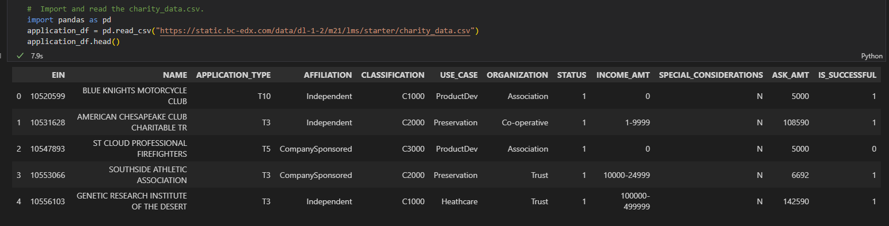
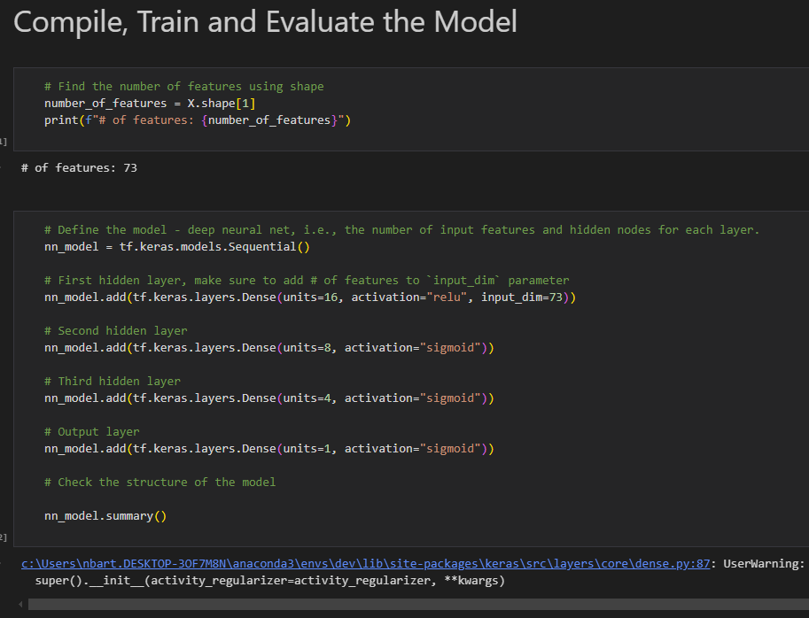
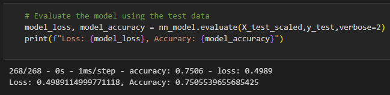

# README for Module 21 Challenge (deep-learning-challenge)

## Introduction

This challenge looks at using deep learning to solve classification problems. The challenge looks at a CSV provided by Alphabet Soup, to look at the sucess rates of the orginzations they have funded. Using the binary success target, the CSV features are used to create a neural network model to predict the success of potential applicants. An intial cursory attempt is made to create a neural network model, then several steps are taken to optimize the model.

## Data

The data consists of a single CSV file provided by Alphabet Soup. The CSV contains data on 34,000 organizations that Alphabet Soup as funded, including columns detailing their binary succcess, their name, ask amount, organization, among others.

## Methodology

First the data requires preprocessing. This includes dropping columns, grouping infrequent categories, casting to integer, and converting categorical data to numeric using `get_dummies`.  Next the model is the model is scaled using `StandardScaler` to vertically compress the data and make it easier for the neural network model to process. Then the model is defined (how many layers, neurons, etc.), fit and evaluated.

This process was done repeatedly while tuning the model. The final report ("Report.md in the repo") outlines all of these steps in more detail.

(The above shows the final optimized model being defined. This definition was tuned repeatedly during this challenge, along with other aspects of the model.)

## Results

The final result is a model with an accuracy that tests just slightly over 75% accuracy. This was the target model performance, and as such the result was succesful for this challenge. However a 75% accuracy is by no means perfect, themodel could likely be optimized with further tuning.

## Conclusion

In conclusion, Alphabet Soup now has functioning model that can predict the success of an applicant with 75% accuracy. This may be helpful for Alphabet Soup, however it should not be the only consideration in their application process. The model will not be perfect and could easily lead them astray. It should be used only as a consideration and not as a determining factor while choosing potential applicants.

## References

Class materials were used extensively for this assignment, as well as:

* stackoverflow.com
* Xpert Learning Assistant
* ChatGPT.com
* https://github.com/mychele-larson/Deep_Learning_Challenge/blob/main/AlphabetSoupCharity_Optimization2.ipynb

## Usage

The report file is located in the main directory of the repo (`Report.md`). This report provides a comprehensive summary of the neural network model.

The model `.h5` files are saved to the repo, and are located in the `Output` directory. All images are located in the `images` directory of the repo.
