# Report on the Neureal Network Model (Module 21 Challenge)

## Overview

The purpose of this analysis is to help Alphabet Soup select successful applicants for funding. Using their CSV containing over 34,000 organizations that have been funded by Alphabet Soup, a neural network model was created to predict success. The original CSV is sampled here:

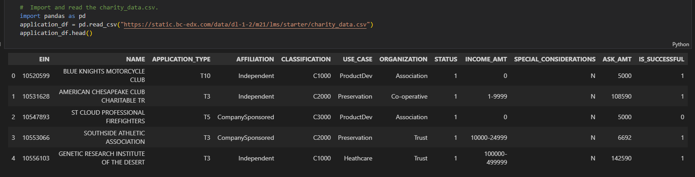

## Results

### Data Preprocessing

    - The target variable for the model is the "IS_SUCCESSFUL" colum of the data frame. It's values are binary {0: Not Successful, 1: Is Successful}):

    - The features of the model are the rest of columns with various categorial or continuous values:

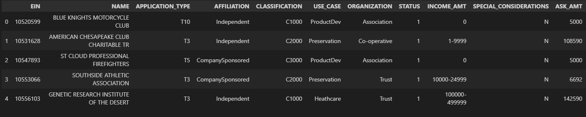

    - For the initial model (before optimization) the columns "EIN" and "NAME" were removed. They were deemed to be neither targets nor features:

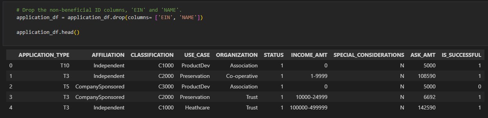

Other preprocessing steps include grouping infrequent categories in the "APPLICATION_TYPE" and "CLASSIFICATION" columns to limit the number of unique values. Too many unique values could create too much noise for the model. Also all the categorical values were changed to boolean using `.get_dummies` and finally changed to binary integers (0,1) with simple casting `.astype(int)`. Some examples here (view full script file to see full extent of preprocessing):

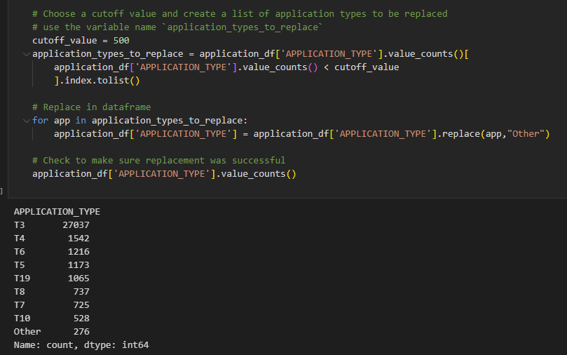

(The above shows the "APPLICATION_TYPE" column being grouped to create an "Other" category to help limit the number of unique entries)

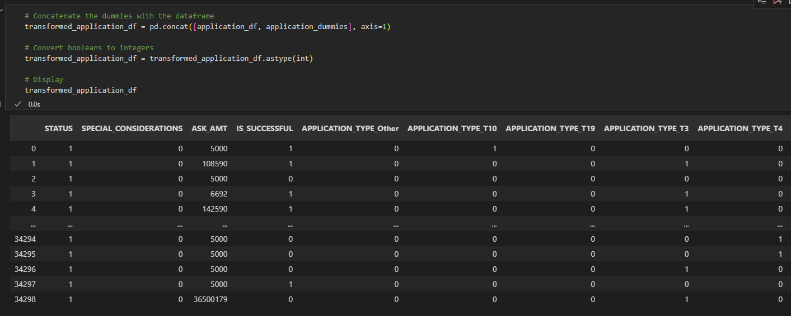

(The above shows a sample of the final data frame after preprocessing. All categorical data has been changed to binary for the model.)

### Compiling, Training, and Evaluating Model

    - For the initial model (before optimization) I chose:

- neurons: 16 (per layer)
- layers: 2 hidden layers
- activation function: "relu"

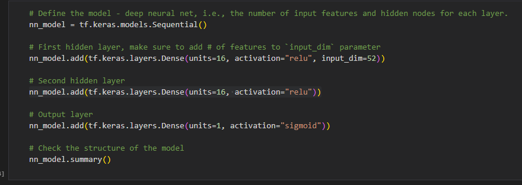

I made these choices to create a simple model initially. I chose a relatively low number of neurons and hidden layers to help the model work quickly.  The "relu" activation function was chosen because it is a good all around option for classification models. The was an initial test stage to get an idea of the problem.

    - This initial test was not successful in hitting the target model performance (accuracy: 75%):

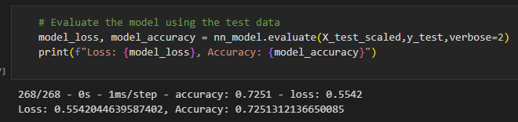

(The above shows that the accuracy of the initial model was 72%, significantly below the target model performance.)

#### Optimization Steps

##### First Attempts (Many Similar Attempts)

Many attempts were made to optimize this model. Not every attempt for documented properly however initial attempts focused mainly on changing the number of layers and neurons. Added as many as 4 hidden layers. Added as many as 200 neurons. Added as many as 200 epochs. These attempts did not yield significant results. The model plateaued almost immediately in all these cases. After as few as 5 epochs there was no significant change.

##### Second Attempts (Several Similar Attempts)

I decided to try and adjust the learning rate of the "adam" optimizer. I learned that sometimes the optimizer bounces around if the learning rate is too high. Essentially it learns too well and does not allow itself to converge. I changed the optimizer and achieved some results, slightly higher accuracy (around 73%). This was encouraging but still did not meet the target model performance.

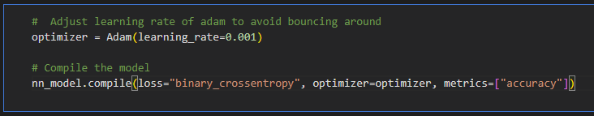

##### Third Attempt

I tried removing the "CLASSIFICATION" column, but this greatly reduced accuracy. I then attempted to bin classification into three distinct groups (High, Medium, and Low) to see if I could reduce noise in the model:

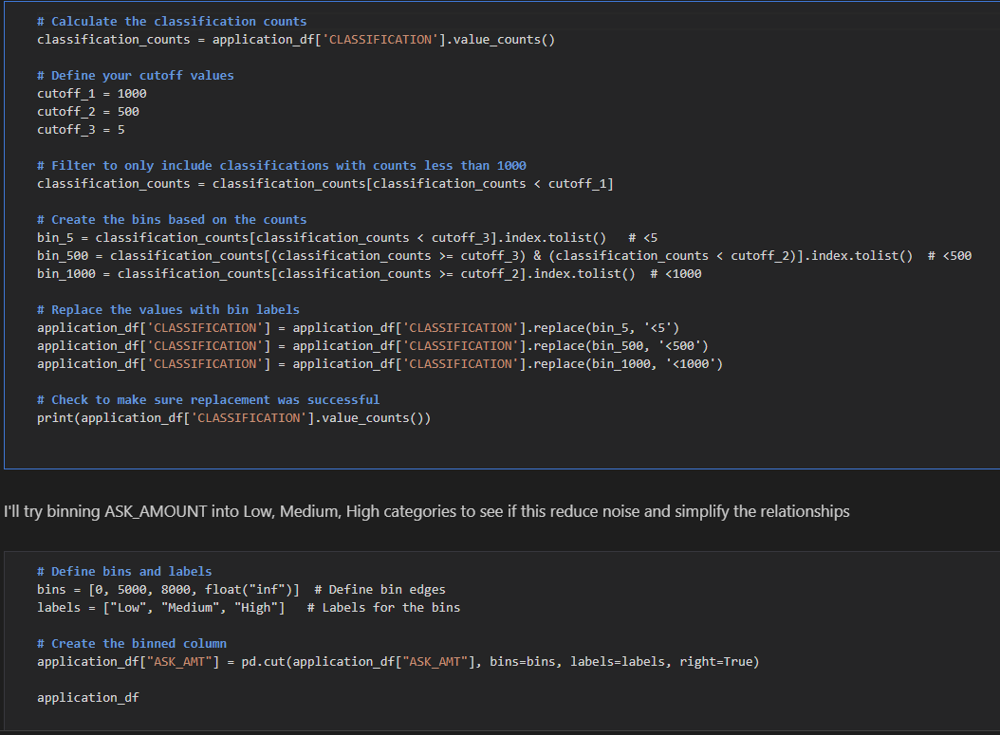

This however did not yield any significant results. I believe it slightly reduced accuracy overall, and this attempt was reverted and abandoned.

##### Fourth Attempt

I decided not to abandon my attempt to optimize this model. After consulting with classmates, we decided we might try to use RandomForest to priotize features and hopefully gain some accuracy. RandomForest is able to gauge the relative importance of features. I was hoping this could make the difference in the model. 

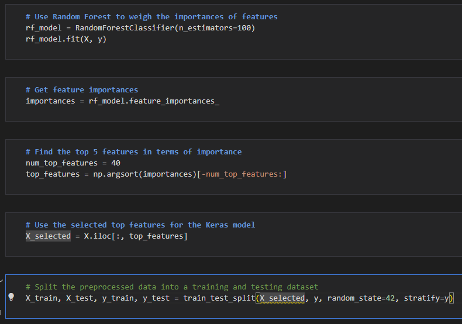

While the training data got execellent accuracy (over 90%), when the test was complete the accuracy was very low (around 60%). The attempt was also reverted and abandoned.

##### Sixth Attempt

Similar to the third attempt, I tried binning the "ASK_AMT" column, for similar reasons. This too did not yield results.

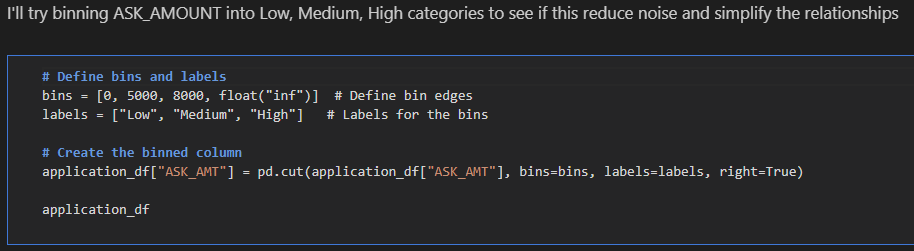

##### **Seventh Attempt**

Finally I tried adding the "NAME" column back to the data frame and got surprising results. The accuracy was definitely changing as a result. I tried to group less frequent categories in the "NAME" column to reduce noise and simplify relationships. This process took a lot of time, the data frame was very large, but finally I saw results:

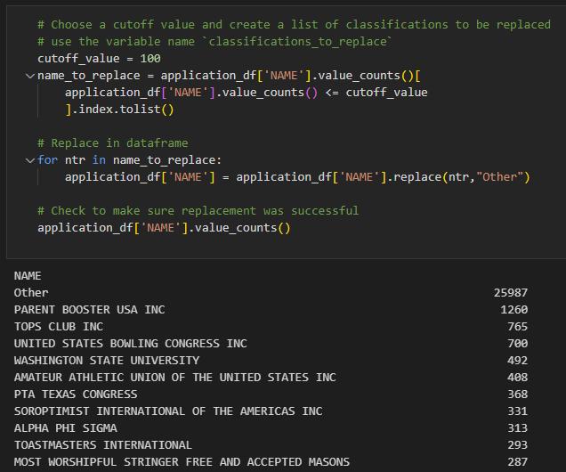

(The above shows the attempt to group less frequent categories in the "NAME" column to reduce unique values. You can see that the "Other" category is massive, this step greatly reduced noise.)

I also changed the number of neurons, layers and activation functions for this model. From trial and error I noticed that increasing neurons and hidden layers did not achieve much. I greatly lowered the number of neurons, but added a hidden layer. I reduced the number of neurons in a decreasing amount, which I had heard could help streamline the model. I also tried changing the activation function to "sigmoid" as it was supposedly good for binary classification. Finally I greatly reduced the number of epochs down to 30 (not shown), as the model was taking a long time fit properly and the previously mentioned plateauing I noticed from pervious attempts.

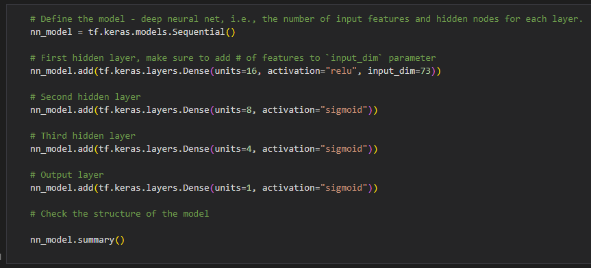

Finally, as you can see below, the model yielded an accuracy of 75%:

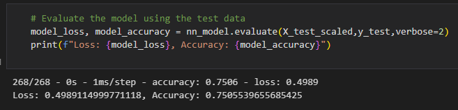

## Summary

Overall this model performed well. 75% accuracy is not perfect so this would not be acceptable for healthcare. However in this case the model could potentially be helpful for Alphabet Soup, at least as an idea of where these applicants stand.

The final optimized model used the "IS_SUCCESSFUL" column as a target, and all the but "EIN" column as features. It grouped infrequent categories in the "APPLICATION_TYPE", "CLASSIFICATION", and "NAME" columns. It used `.get_dummies` and casting to convert categorical data to numeric. The model used 3 hidden layers, using the "relu" activation function for the first layer, then "sigmoid" for the following two layers. It used a bottleneck or funnel-shaped structute, decreasing the number of neurons per hidden layer, to help refine or compress the data representation as it moves through the network.

A more precise model may include more data. 34,000 rows of data is large, however for a neural network it might be a little small. A larger sample size, or training data, could help the model fit with more preision. The model itself could potentially be tweaked further by adding the "EIN" column (similar to how "NAME" was added). This could potentially give the training data a little more to work with. 

Some limitations of this optimization could be related to optimizers. Only the "adam" optimizer was used here, although its learning rate was tuned. Other optimizers could perhaps be used, although "adam" is considered as very good all around optimizer. This is why it was used exlusively. Other potential optimizers to try could be: Adagrad or RMSprop.

I think the main reason this model is performing lower is because of the lack of sufficient data. After hours of tuning the model, I do not believe a combination of neurons, hidden layers, activation functions, and epochs with significantly improve its performance. It is however possible that further tuning could help, it is not out of the question. Simply put, if you want more accuracy, provide more training data to help the model learn.
